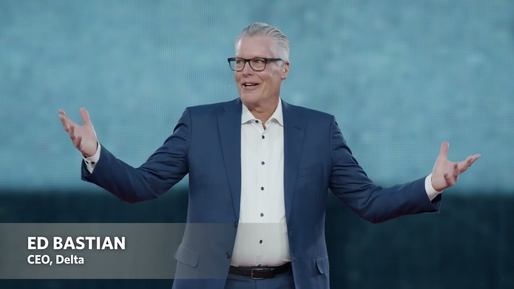
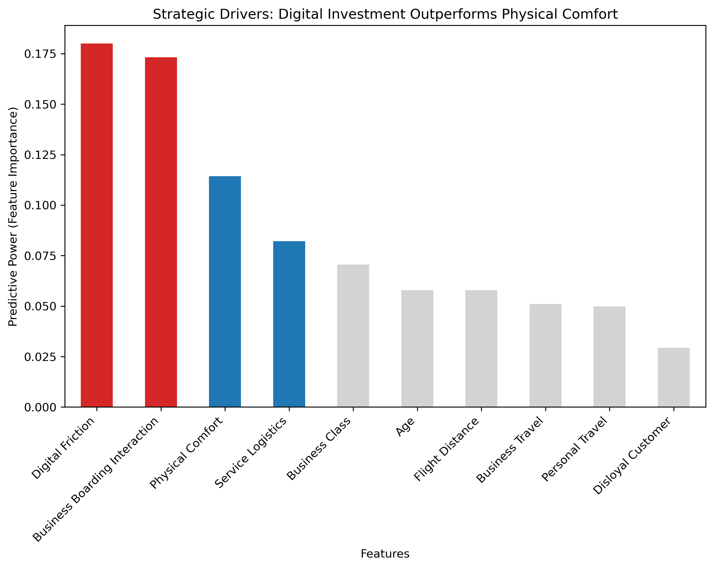

# EXECUTIVE SUMMARY

## The Digital Handshake: Validating the CES 2025 Vision for Premium Retention

### 1. Strategic Context: The Vision vs. The Reality

At CES 2025, Delta CEO Ed Bastian outlined a bold future for the airline industry, stating: "Technology is a powerful tool, but it’s people that make true innovation possible." He argued that the next century of flight will be defined by using cutting-edge advancements to enrich human experiences ([CES 2025](https://youtu.be/CV8V6oqP4pw?si=AxYRACqqYoEVTo5a)).

**The Business Question:** Is this focus on technology merely a branding exercise, or is it a financial imperative? Given the industry's razor-thin operating margins (~3.6%), does investing in "Human-Centric Tech" actually drive retention among the Business Class passengers who generate up to 75% of airline profits?

**The Project Scope:** I analyzed passenger satisfaction data and utilized Random Forest modeling to mathematically test Bastian's hypothesis. My goal was to determine if digital infrastructure is a "Nice-to-Have" perk or the primary driver of premium customer loyalty.

### 2. Key Findings: Digital Reliability > Physical Comfort
Contrary to the traditional belief that "Hardware" (Seats, Food, Legroom) is the main differentiator for Business Class, our predictive modeling reveals a different hierarchy of needs.

**The "Strategic Model" Results:** When pitting "Digital Friction" against "Physical Comfort," the data was unequivocal.
- **#1 Predictor:** The Digital Experience. Composite scores for App Reliability, Online Boarding, and Wifi were the strongest predictors of Business Class satisfaction.
- **The "Digital Handshake":** The data defines a critical workflow I call the "Digital Handshake" (App $\to$ Lounge $\to$ Boarding). A single digital failure (e.g., a boarding pass glitch) creates a Detractor Event that physical luxury cannot undo.

**Feature Importance by Strategic Category**: A visual comparison of predictive weight between Digital Infrastructure (Red) and Physical Amenities (Blue). The data indicates that "Soft Product" elements (connectivity and digital reliability) currently carry more weight in determining Business Class satisfaction than traditional "Hard Product" assets.

### 3. Voice of the Customer: The Mechanism of Failure

To understand how technology impacts the human experience (as Bastian highlighted), I conducted a qualitative analysis of recent feedback from premium frequent flyers. The results confirm that digital failures are direct Revenue Blockers.
- **The Blocked Upgrade:** Customers reported that app glitches actively prevented them from purchasing upgrades.
    > "My upgrade triggered a system glitch that canceled the second leg... I’ve been put on the waitlist again." (Active Revenue Loss)
- The Hidden Inventory: Customers attempting to buy Business Class seats were blocked by UI failures.
    > "On neither website nor app can I see business class seats... I’d like to know the cost to upgrade." (Failed Conversion)
    
### 4. Recommendation: From "New Tech" to "Infrastructure"

The data strongly supports Ed Bastian’s CES thesis, but with a specific caveat. While Bastian introduces "Delta Concierge", a Gen AI-powered travel companion, as a solution, I argue that innovation must prioritize <u>reliability</u> over novelty.

To maximize ROI on the CES vision, airlines should shift capital allocation strategies:
- **Defend the Premium Workflow:** Prioritize IT investments that secure the "Digital Handshake" (Check-in $\to$ Lounge $\to$ Boarding) for Business Class travelers.
- **Treat Glitches as Churn:** Reclassify app errors not as "IT tickets" but as "Customer Experience Failures" with the same severity as a cancelled flight.
- **Scale Software, Not Just Seats:** Recognizing that digital improvements scale instantly across the fleet, while physical retrofits take years.

**Conclusion:** Ed Bastian is right, technology is the tool to enrich human experience. But our data proves that for the most profitable passengers, the most enriching technology is simply reliability.